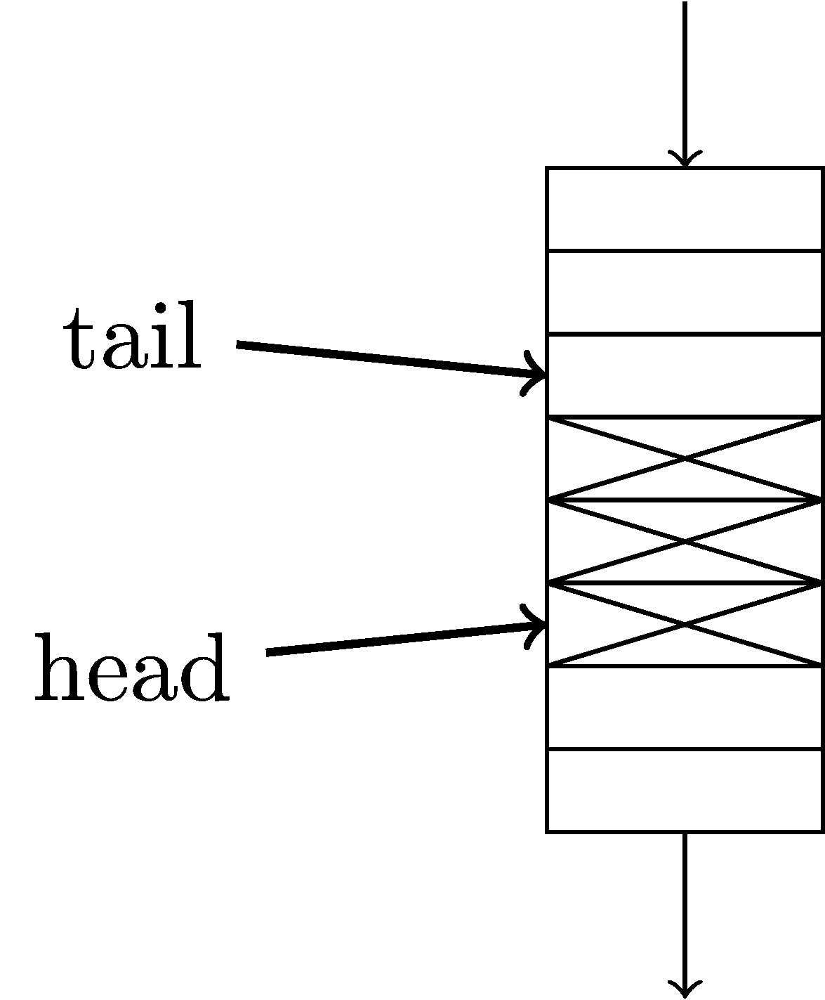

# A-Scalable-Unsegmented-Multi-port-Memory-for-FPGA-based-Systems
A library of on-chip multi-port memory cores designed for FPGAs
TODO: overview

## Standard FIFO
TODO: description
TODO: picture

## Arbiter
TODO: description
TODO: picture

## Fully-connected Interconnect
TODO: description
TODO: picture

## Omega Multistage Interconnect
TODO: description
TODO: picture

## Linked FIFO
TODO: description
TODO: picture

## Fully-connected Multi-port Memory
TODO: description
TODO: picture

## Omega Multi-port Memory
TODO: description
TODO: picture

## Gold Multi-port Memory
TODO: description
TODO: picture

## Reorder Queue
TODO: description
TODO: picture
